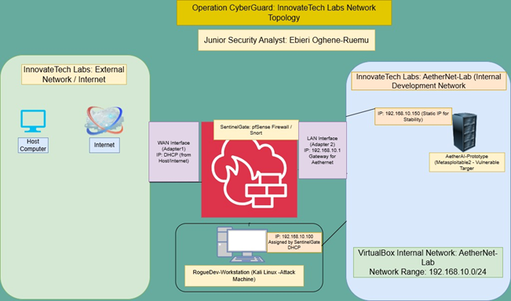
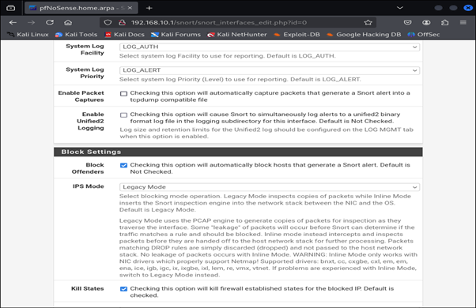
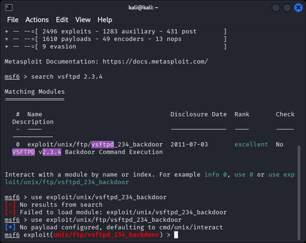

# 🛡️ WCDN – CyberGuard Network Lab  
### Intrusion Detection & Network Defense Environment  
**pfSense | Snort IDS/IPS | Kali Linux | Metasploitable2**

---

## 🔍 Project Overview

The **CyberGuard Network Lab** is a fully simulated enterprise network defense environment designed to evaluate **intrusion detection**, **firewall visibility**, and **threat response** using **pfSense** and **Snort IDS/IPS**.  

This project mirrors a real SOC defensive setup by analyzing reconnaissance scans, web vulnerability probing, exploit attempts, and IPS blocking behavior across a controlled VirtualBox environment.

---

## 🧠 Skills Demonstrated

- IDS/IPS Configuration (Snort)
- Firewall deployment and rule management (pfSense)
- Reconnaissance detection (Nmap, Nikto)
- Exploit monitoring and alert correlation
- Log analysis and event triage
- Attack chain reconstruction
- Network segmentation & monitoring
- Documentation and reporting following SOC standards

---

## 🛠️ Tools & Technologies

**pfSense**, **Snort**, **Kali Linux**, **Metasploitable2**, **VirtualBox**,  
**Nmap**, **Metasploit**, **ET Rule Sets**, **Firewall Logs**

---

# 📂 Repository Structure

---

# 🖼️ Architecture Diagram

Your lab uses a **three-node virtualized defensive network**:

- **pfSense Firewall** – Gateway, NAT, firewall, Snort host  
- **Kali Linux** – Attacker conducting recon + exploit attempts  
- **Metasploitable2** – Vulnerable target used to trigger Snort alerts  

---

# 📸 Screenshots (Simulated Evidence)

Below is the evidence collected during analysis.  
Each image is stored in:

### **Network & Firewall Evidence**
- **pfSense Logs**  
  

### **IDS/IPS & Attack Activity**
- **Snort Alerts**  
  

- **Snort Interface Settings**  
  !(documentation/screenshots/07_snort-interface.png)

- **Attack Traffic (Kali → Metasploitable)**  
  

- **Metasploitable Target Host**  
  

- **Rule Trigger Evidence**  
  

---

# 📘 Documentation

- **Methodology:**  
  `documentation/methodology.md`

- **Findings Report:**  
  `documentation/findings.md`

- **Executive Summary (PDF):**  
  `reports/executive-summary.pdf`

---

# 🧩 Lessons Learned

- Snort rule tuning is essential to reduce false positives  
- Reconnaissance traffic (Nmap, Nikto) produces very reliable detection  
- pfSense + Snort provides strong visibility for SOC learning  
- Attack timestamps help validate alert accuracy  
- Proper log review is a core blue-team skill  
- IPS mode is powerful but rule-dependent  
- Segmentation greatly improves monitoring depth  

---

# ⚖️ Ethical Notice

This project was conducted in a **closed, isolated virtual environment**.  
All scans and exploitation attempts were executed against intentionally vulnerable lab systems.  
No external or production networks were targeted.

---

# 🏁 Summary

The **CyberGuard Network Lab** demonstrates hands-on SOC analyst skills through firewall configuration, IDS/IPS deployment, attack simulation, alert triage, and defensive response workflows.  
This project reflects real-world blue-team analysis and showcases your readiness for SOC, detection engineering, and network defense roles.

